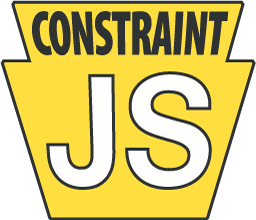

<p align="center">
  
</p>

# ConstraintJS

ConstraintJS keeps values up to date automatically. A _constraint_ is a value that can be computed from other constraints; when one of those changes, everything that depends on it updates. On top of that, ConstraintJS provides DOM bindings, finite-state machines, and a Handlebars-style template language whose output stays in sync with your data.

```js
import cjs from "constraintjs";

const width = cjs(10);
const height = cjs(20);
const area = width.mul(height); // or: cjs(() => width.get() * height.get())

area.get(); // 200
width.set(15);
area.get(); // 300

// Keep the DOM in sync
cjs.bindText(document.getElementById("area"), "Area: ", area);

// ...or use a template
const box = cjs.createTemplate("<div>{{width}} × {{height}} = {{area}}</div>", { width, height, area });
document.body.append(box);
```

For documentation and the full API, visit the [ConstraintJS website](https://cjs.from.so/) and its [API reference](https://cjs.from.so/api/).

## Installation

```sh
npm install constraintjs
```

```js
import cjs from "constraintjs"; // ES modules
const cjs = require("constraintjs"); // CommonJS
```

Or load it with a `<script>` tag, which defines a global `cjs`:

```html
<script src="https://cdn.jsdelivr.net/npm/constraintjs/dist/constraintjs.global.min.js"></script>
```

ConstraintJS includes TypeScript types. Types can be imported by name (`import cjs, { type Constraint } from "constraintjs"`) or used as `cjs.Constraint<T>`.

## Development

You'll need [Node.js](https://nodejs.org/) 22.18 or later.

```sh
npm install
npm test            # run the tests (Vitest, in jsdom)
npm run build       # build dist/ (ES module, CommonJS, and <script> bundles, with types)
npm run check       # type-check, lint, check formatting, and test
npm run docs        # generate API documentation in docs/
```

The source is in `src/` (TypeScript) and the tests are in `test/`. `npm run test:watch` re-runs the tests as you edit, and `npm run coverage` reports test coverage.

The website is the `gh-pages` branch. To update it for a release, check that branch out somewhere and run `npm run pages -- <path to the checkout>`, which adds the new `<script>` bundles and API reference to it.

See [CHANGELOG.md](CHANGELOG.md) for what's changed.

## License

[MIT](LICENSE)
